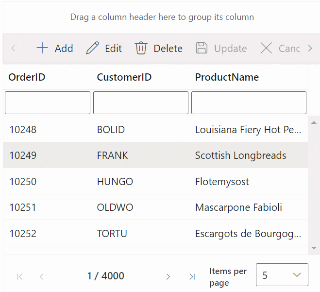

# react-data-grid-integration-with-sharepoint
The repository contains a professional demonstration of a SharePoint Framework application featuring a React Grid control. This application showcases essential functionalities such as filtering, searching, grouping, editing, and paging actions, all implemented using custom binding with the Redux concept.

* Execute the following command to install Glup globally,  
`npm install -g gulp`
* Execute the following command to install the necessary dependencies, 
`npm install`
* Change the initial path of the **config/serve.json** to your sharepoint site instead of {tenantDomain}
* To prevent certificate-related issues, use the following command,  
`gulp trust-dev-cert`
* Run the project using following command,  
`gulp serve`
* Click the **Add a new web part in column one** button.
* Select the **ReactGridComponent** web part.

Finally, the Syncfusion React Grid control is rendered in your SharePoint Framework client-side web part.

